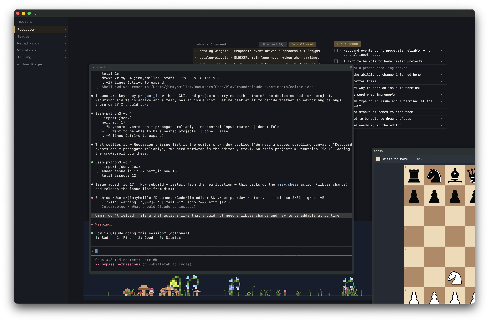

# Jim - An (Editor | IDE | Mess) Made Only for Me

I've always longed to be able to do my programming work fully in an environment of my own creation. This is the first time I've been able to achieve that goal. Right now it is very early days, very messy. But I have a ton of ideas and have been able to add them all. One day, this will all look way better. But right now, it does in fact work. (But again, probably only for me). 

As time goes on I will add descriptions and docs and things about how it works. I'm working on my own widgeting system, styling language, and soon programming language for it. 

This thing is fully vibe coded. I mean that in the truest sense. I do not review the code at all. The terminal is powered by libghostty, the whole app uses bevy.